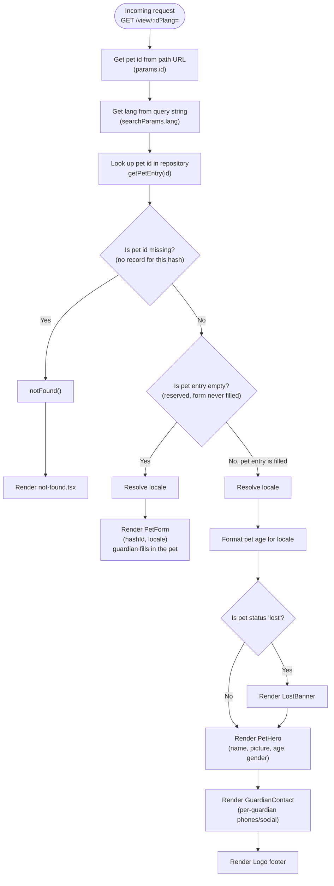

# View Page

The main page for the View Pet flow: `GET /view/:id?lang=`.

`:id` is the opaque hash printed as a QR code on the physical tag. This route
is the entire reason that hash exists — scanning the tag lands here, and
everything the page does is figure out which of three states that hash is in
and render accordingly.

## The three states

`getPetEntry(id)` (`@/lib/repository`) resolves the id to a `PetEntry`
discriminated union (`src/types/pet.ts`):

| Status   | Meaning                                                              | Rendered UI                     |
| -------- | --------------------------------------------------------------------- | -------------------------------- |
| `missing` | No record for this hash at all — unknown/invalid/malformed id        | Next.js `notFound()` → `not-found.tsx` |
| `empty`   | Hash is reserved (tag was generated) but the guardian hasn't filled the pet form yet | `PetForm` (onboarding)          |
| `filled`  | Pet data exists                                                      | Public pet profile               |

Note: `empty` is a *data* state, not "the URL id is an empty string." An
empty/malformed `:id` segment is exactly what produces `missing` — Next's
routing itself never lets `:id` be an empty string, since `/view/` (no
segment) doesn't match this dynamic route at all.

## Logic flow

`generateMetadata` runs the same lookup independently (it's a separate Next.js
entry point, not a step inside the flow above) to set the page `<title>` —
`"{pet.name} · View Pet"` when filled, `"View Pet"` otherwise — and attaches
`robots: noindex, nofollow` no matter which of the three states is hit.

## Notes

- **Rendering is forced dynamic** (`export const dynamic = "force-dynamic"`)
  — every request hits the repository, no static caching. Correct here: the
  same `:id` can transition `empty → filled` or `active → lost` at any time,
  and a stale cached page would show wrong contact info during an emergency.
- **`getPetEntry` runs twice per request** — once in `generateMetadata`, once
  in the page component. Next.js doesn't dedupe these automatically across
  the two entry points; if this DB round-trip ever becomes a cost concern,
  wrap it in React's `cache()`.
- **Locale** (`resolveLocale(lang)`) only affects copy/formatting (e.g.
  `formatAge`) — it does not affect which of the three states renders.
- **Privacy**: `robots: { index: false, follow: false }` is set unconditionally,
  for all three statuses, so the guardian's phone/email on a `filled` profile
  is never indexable — the page is meant to be reached via the QR code, not a
  search engine.
